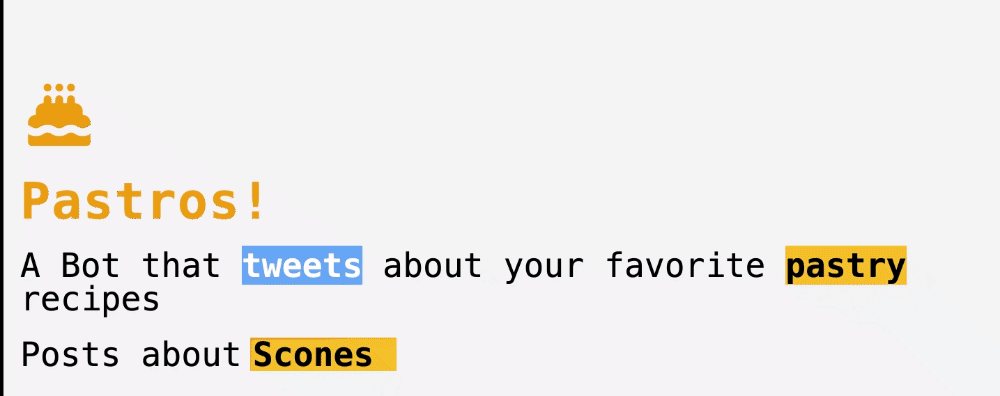

# NextJS Type Text Animation

A Demo showing how to make beautiful Typing Text Animation in NextJS using [react-typical](https://www.npmjs.com/package/react-typical)

## Screenshots



&nbsp;

Live preview can be found [here](https://next-type-animate.vercel.app/)

## Run Locally

Clone the project

```bash
  git clone https://github.com/DavidAmunga/next-type-animate.git
```

Go to the project directory

```bash
  cd next-type-animate
```

Install dependencies

```bash
  yarn install
```

Start the server

```bash
  yarn run dev
```

## Authors

- [David Amunga](https://www.github.com/DavidAmunga)
